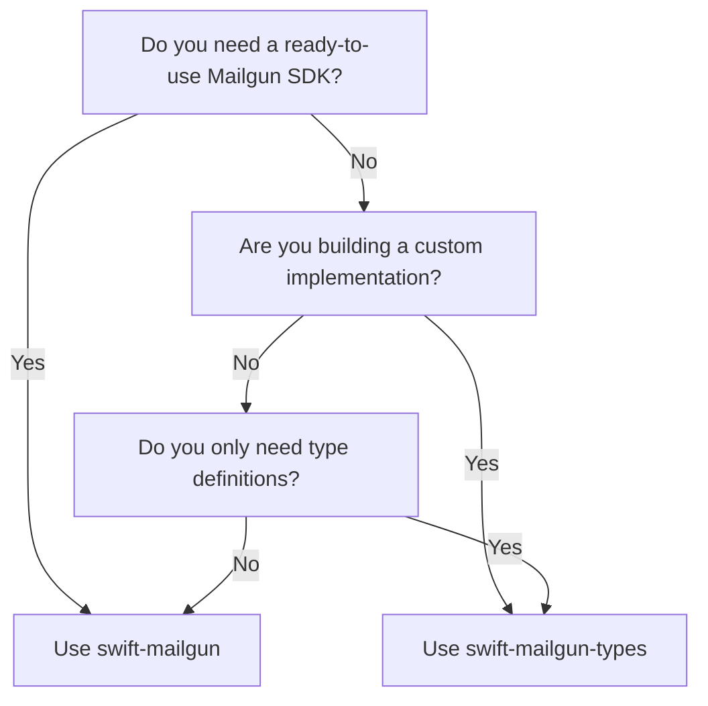

# swift-mailgun-types

[](https://swift.org)
[]()
[](LICENSE)
[](https://github.com/coenttb/swift-mailgun-types/actions/workflows/ci.yml)

Type-safe foundation for Mailgun Swift SDKs with comprehensive API coverage.

## Table of Contents

- [Overview](#overview)
- [Getting Started](#getting-started)
- [Architecture](#architecture)
- [Features](#features)
- [Installation](#installation)
- [Module Reference](#module-reference)
- [Usage Examples](#usage-examples)
- [Testing](#testing)
- [Advanced Usage](#advanced-usage)
- [API Documentation](#api-documentation)
- [Requirements](#requirements)
- [Example Projects](#example-projects)
- [Contributing](#contributing)
- [Support](#support)
- [License](#license)

## Overview

**swift-mailgun-types** provides the foundational building blocks for type-safe Mailgun integrations in Swift. It defines comprehensive domain models, API routes, and client interfaces with compile-time validation and modern Swift concurrency support.

> **⚠️ Important**: This package provides **types and interfaces only**. For a complete SDK with implementations, use **[swift-mailgun](https://github.com/coenttb/swift-mailgun)**.

```swift
import Mailgun_Messages_Types

// Type-safe request models with compile-time validation
let request = Mailgun.Messages.Send.Request(
    from: try .init("hello@yourdomain.com"),
    to: [try .init("user@example.com")],
    subject: "Welcome to swift-mailgun-types!",
    html: "<h1>Type-safe emails</h1><p>Built with Swift</p>"
)
```

## Getting Started

### Which Package Should You Use?



**Use [swift-mailgun](https://github.com/coenttb/swift-mailgun) if you want:**
- ✅ Ready-to-use Mailgun integration
- ✅ URLSession networking included
- ✅ Authentication handling built-in
- ✅ Production-ready features
- ✅ Quick setup with minimal configuration

**Use swift-mailgun-types if you need:**
- 🎯 Type definitions only (smaller binary size)
- 🔧 Custom networking implementation (Alamofire, AsyncHTTPClient, etc.)
- 🧪 Mock clients for testing
- 📦 Shared types between client and server
- 🏗️ Building your own Mailgun SDK

## Architecture

### Three-Package Architecture

**swift-mailgun-types** is part of a modular three-package ecosystem that provides flexibility and clean separation of concerns:

```
┌─────────────────────────────────────────┐
│          swift-mailgun-types            │
│    (This Package - Types & Interfaces)  │
├─────────────────────────────────────────┤
│ • Domain Models & Types                 │
│ • API Routes (swift-url-routing)        │
│ • Client Interfaces (@DependencyClient) │
│ • Request/Response Types                │
│ • Form Encoding Support                 │
└─────────────────────────────────────────┘
                     ↑
            types imported by
                     ↓
┌─────────────────────────────────────────┐
│          swift-mailgun-live             │
│    (Core Implementation Package)        │
├─────────────────────────────────────────┤
│ • URLSession Networking                 │
│ • Authentication (swift-authenticating) │
│ • Live Client Implementations           │
│ • Environment Configuration             │
│ • Core Mailgun Functionality            │
└─────────────────────────────────────────┘
                     ↑
              re-exported by
                     ↓
┌─────────────────────────────────────────┐
│           swift-mailgun                 │
│    (Developer Entry Point Package)      │
├─────────────────────────────────────────┤
│ • Re-exports swift-mailgun-live         │
│ • Additional Integrations:              │
│   - swift-html support                  │
│   - swift-identities integration        │
│   - Convenience APIs                    │
│ • Higher-level abstractions             │
└─────────────────────────────────────────┘
```

### Modular Structure

The package is organized into focused, independent modules that can be imported separately:

```
swift-mailgun-types/
├── Core Types
│   ├── Mailgun Types          # Root types and aggregation
│   └── Mailgun Types Shared   # Shared utilities
│
├── Communication
│   ├── Mailgun Messages Types # Email sending
│   ├── Mailgun Templates Types# Email templates
│   └── Mailgun Lists Types    # Mailing lists
│
├── Domain Management
│   ├── Mailgun Domains Types  # Domain configuration
│   ├── Domain Keys            # API keys per domain
│   ├── DKIM Security          # DKIM settings
│   ├── Domain Connection      # Connection settings
│   └── Domain Tracking        # Tracking configuration
│
├── Analytics & Reporting
│   ├── Mailgun Reporting Types
│   │   ├── Events             # Event tracking
│   │   ├── Stats              # Statistics
│   │   ├── Metrics            # Metrics API
│   │   ├── Logs               # Log access
│   │   └── Tags               # Tag management
│
├── Suppressions & Compliance
│   ├── Mailgun Suppressions Types
│   │   ├── Bounces            # Bounce management
│   │   ├── Complaints         # Complaint handling
│   │   ├── Unsubscribes       # Unsubscribe lists
│   │   └── Allowlist          # Allowlist management
│
├── Infrastructure
│   ├── Mailgun IPs Types      # IP management
│   ├── Mailgun IPPools Types  # IP pool management
│   │   ├── Static IP Pools    # Manual IP assignment
│   │   └── Dynamic IP Pools   # Automatic with health checks
│   ├── Mailgun IPAllowlist    # IP allowlist
│   └── IP Address Warmup      # IP warmup scheduling
│
├── Account & Access
│   ├── Mailgun Users Types    # User management
│   ├── Mailgun Subaccounts    # Subaccount management
│   ├── Mailgun Keys Types     # API key management
│   └── Mailgun Credentials    # SMTP credentials
│
└── Advanced Features
    ├── Mailgun Routes Types   # Email routing rules
    ├── Mailgun Webhooks Types # Webhook configuration
    └── Mailgun CustomMessageLimit # Rate limiting
```

### Benefits of This Architecture

1. **🎯 Flexible Package Selection**: Choose the right level of abstraction for your needs
2. **🧩 Clean Separation**: Types, implementation, and integrations are cleanly separated
3. **🔄 Multiple Implementations**: Use URLSession via swift-mailgun-live, or build custom with swift-mailgun-types
4. **🧪 Superior Testing**: Mock clients without network dependencies
5. **📦 Code Sharing**: Use the same types on client and server
6. **🚀 Type Safety**: Compile-time validation of all API interactions
7. **🔌 Dependency Injection**: Built-in support via @DependencyClient
8. **🎨 Progressive Enhancement**: Start with swift-mailgun for convenience, drop down to lower levels when needed

## Features

### 📋 Comprehensive API Coverage

All Mailgun API features are fully typed and organized by domain:

#### Core Communication
| Feature | Description | Status |
|---------|-------------|:------:|
| **Messages** | Send emails, MIME messages, manage queues | ✅ |
| **Templates** | Create and manage email templates | ✅ |
| **Lists** | Mailing list management | ✅ |

#### Domain Management
| Feature | Description | Status |
|---------|-------------|:------:|
| **Domains** | Create and manage sending domains | ✅ |
| **Domain Keys** | Domain-specific API keys | ✅ |
| **DKIM Security** | DKIM configuration and rotation | ✅ |
| **Domain Connection** | SMTP and API connection settings | ✅ |
| **Domain Tracking** | Click, open, and unsubscribe tracking | ✅ |

#### Suppressions & Compliance
| Feature | Description | Status |
|---------|-------------|:------:|
| **Bounces** | Manage bounced emails | ✅ |
| **Complaints** | Handle spam complaints | ✅ |
| **Unsubscribes** | Manage unsubscribe lists | ✅ |
| **Allowlist** | Never suppress these addresses | ✅ |

#### Analytics & Reporting
| Feature | Description | Status |
|---------|-------------|:------:|
| **Events** | Query email events | ✅ |
| **Stats** | Aggregated statistics | ✅ |
| **Metrics** | Advanced metrics and dimensions | ✅ |
| **Tags** | Tag-based analytics | ✅ |
| **Logs** | Raw event logs | ✅ |

#### Infrastructure
| Feature | Description | Status |
|---------|-------------|:------:|
| **IPs** | Dedicated IP management | ✅ |
| **IP Address Warmup** | Automated warmup scheduling | ✅ |
| **Static IP Pools** | Manual IP pool assignment | ✅ |
| **Dynamic IP Pools** | Automatic assignment with health checks | ✅ |
| **IP Allowlist** | IP access control | ✅ |

#### Account & Access Control
| Feature | Description | Status |
|---------|-------------|:------:|
| **Users** | User account management | ✅ |
| **Subaccounts** | Subaccount creation and management | ✅ |
| **API Keys** | API key management | ✅ |
| **SMTP Credentials** | SMTP credential management | ✅ |
| **Message Limits** | Custom rate limiting | ✅ |
| **Account Management** | Account settings and info | ✅ |

#### Advanced Features
| Feature | Description | Status |
|---------|-------------|:------:|
| **Routes** | Email routing rules | ✅ |
| **Webhooks** | Webhook configuration | ✅ |

### 🛡️ Type Safety & Modern Swift

- **Swift 5.10+** with Swift 6 readiness
- **@DependencyClient** for testable interfaces
- **@CasePathable** for ergonomic enum handling
- **swift-url-routing** for type-safe API routes
- **Sendable** conformance throughout
- **Comprehensive Codable** models
- **Progressive disclosure** with sensible defaults

## Recent Updates 🎉

### Version 0.2.0 (September 2025)
- 🏗️ **Architectural Restructuring**: Split into three-package ecosystem for maximum flexibility
  - `swift-mailgun-types`: Core types and interfaces (this package)
  - `swift-mailgun-live`: URLSession-based implementation
  - `swift-mailgun`: Developer-friendly entry point with additional integrations
- 🔄 **Package Renaming**: Migrated from `coenttb-mailgun` to `swift-mailgun` ecosystem
- 📦 **Improved Modularity**: Better separation of concerns between types, implementation, and integrations
- 🎯 **Flexible Integration**: Choose the right package for your use case
- ✅ **Backward Compatible**: Types remain unchanged, only package structure improved

### Version 0.1.0 (February 2025)
- ✅ **All Tests Passing**: Fixed compilation errors across 110+ test files
- ✅ **Form Encoding Improvements**: Added specialized encoders for Routes and Events APIs
- ✅ **API Alignment**: Updated types to match actual Mailgun API responses
- ✅ **Namespace Enum Pattern**: Consistent organization across all modules
- ✅ **Bug Fixes**: 
  - Fixed array encoding strategies for Routes API
  - Resolved multipart form boundary issues in tests
  - Fixed Subaccounts delete endpoint header handling
  - Corrected Events API date parameter ordering for descending queries
- ✅ **Swift 6.0 Ready**: Full language mode support with strict concurrency
- ✅ **100% API Coverage**: All Mailgun APIs fully typed and tested

## Installation

### Option 1: Complete SDK with Integrations (Recommended for Most Users)

```swift
// Package.swift
dependencies: [
    .package(url: "https://github.com/coenttb/swift-mailgun", from: "0.2.0")
],
targets: [
    .target(
        name: "YourApp",
        dependencies: [
            .product(name: "Mailgun", package: "swift-mailgun")
        ]
    )
]
```

This gives you:
- ✅ Full Mailgun functionality via URLSession
- ✅ HTML email support via swift-html
- ✅ Identity integration support
- ✅ All convenience APIs and helpers

### Option 2: Core Implementation Only (Without Extra Integrations)

```swift
// Package.swift
dependencies: [
    .package(url: "https://github.com/coenttb/swift-mailgun-live", from: "0.2.0")
],
targets: [
    .target(
        name: "YourApp",
        dependencies: [
            .product(name: "MailgunLive", package: "swift-mailgun-live")
        ]
    )
]
```

This gives you:
- ✅ Full Mailgun functionality via URLSession
- ✅ Authentication and environment configuration
- ❌ No HTML integration
- ❌ No identity system integration

### Option 3: Types Only (For Custom Implementations)

Install the entire types package:

```swift
dependencies: [
    .package(url: "https://github.com/coenttb/swift-mailgun-types", from: "0.2.0")
],
targets: [
    .target(
        name: "YourApp",
        dependencies: [
            // All types in one import
            .product(name: "Mailgun Types", package: "swift-mailgun-types")
        ]
    )
]
```

### Option 4: Individual Modules (Minimal Binary Size)

Import only the specific modules you need:

```swift
dependencies: [
    .package(url: "https://github.com/coenttb/swift-mailgun-types", from: "0.2.0")
],
targets: [
    .target(
        name: "YourApp",
        dependencies: [
            // Pick only what you need
            .product(name: "Mailgun Messages Types", package: "swift-mailgun-types"),
            .product(name: "Mailgun Templates Types", package: "swift-mailgun-types"),
            .product(name: "Mailgun Suppressions Types", package: "swift-mailgun-types")
        ]
    )
]
```

## Module Reference

### Available Modules

Each module can be imported independently for optimal binary size:

| Module Name | Import Statement | Description |
|-------------|------------------|-------------|
| **Mailgun Types** | `import Mailgun_Types` | All types (convenience import) |
| **Mailgun Messages Types** | `import Mailgun_Messages_Types` | Email sending functionality |
| **Mailgun Templates Types** | `import Mailgun_Templates_Types` | Email template management |
| **Mailgun Lists Types** | `import Mailgun_Lists_Types` | Mailing list management |
| **Mailgun Domains Types** | `import Mailgun_Domains_Types` | Domain configuration |
| **Mailgun Suppressions Types** | `import Mailgun_Suppressions_Types` | Bounce/complaint/unsubscribe management |
| **Mailgun Reporting Types** | `import Mailgun_Reporting_Types` | Events, stats, metrics, logs |
| **Mailgun Webhooks Types** | `import Mailgun_Webhooks_Types` | Webhook configuration |
| **Mailgun Routes Types** | `import Mailgun_Routes_Types` | Email routing rules |
| **Mailgun IPs Types** | `import Mailgun_IPs_Types` | IP management and warmup |
| **Mailgun IPPools Types** | `import Mailgun_IPPools_Types` | Static and dynamic IP pools |
| **Mailgun IPAllowlist Types** | `import Mailgun_IPAllowlist_Types` | IP access control |
| **Mailgun Users Types** | `import Mailgun_Users_Types` | User management |
| **Mailgun Subaccounts Types** | `import Mailgun_Subaccounts_Types` | Subaccount management |
| **Mailgun Keys Types** | `import Mailgun_Keys_Types` | API key management |
| **Mailgun Credentials Types** | `import Mailgun_Credentials_Types` | SMTP credentials |
| **Mailgun CustomMessageLimit Types** | `import Mailgun_CustomMessageLimit_Types` | Rate limiting |
| **Mailgun AccountManagement Types** | `import Mailgun_AccountManagement_Types` | Account settings |

### Import Examples

```swift
// Import everything
import Mailgun_Types

// Import only what you need
import Mailgun_Messages_Types
import Mailgun_Templates_Types

// Use the types
let email = Mailgun.Messages.Send.Request(...)
let template = Mailgun.Templates.Template.Create.Request(...)
```

## Usage Examples

### 📧 Sending Messages

```swift
import Mailgun_Messages_Types

// Simple email
let simpleEmail = Mailgun.Messages.Send.Request(
    from: try .init("noreply@yourdomain.com"),
    to: [try .init("user@example.com")],
    subject: "Hello!",
    text: "Welcome to our service."
)

// Rich email with all features
let richEmail = Mailgun.Messages.Send.Request(
    from: try .init("Newsletter <news@yourdomain.com>"),
    to: [
        try .init("subscriber1@example.com"),
        try .init("subscriber2@example.com")
    ],
    subject: "Monthly Newsletter",  // subject must come before cc/bcc
    html: """
        <h1>Your Monthly Update</h1>
        <p>Check out our latest features!</p>
        
    """,
    text: "Your Monthly Update - Check out our latest features!",
    cc: [try .init("manager@yourdomain.com")],
    bcc: [try .init("archive@yourdomain.com")],
    template: "monthly-newsletter",
    templateVariables: #"{"month":"January","year":"2024"}"#,  // JSON string
    attachments: [
        Mailgun.Messages.Attachment.Data(
            data: reportData,
            filename: "report.pdf",
            contentType: "application/pdf"
        )
    ],
    inline: [
        Mailgun.Messages.Attachment.Data(
            data: logoData,
            filename: "logo.png",
            contentType: "image/png"
        )
    ],
    tags: ["newsletter", "monthly"],
    deliveryTime: Date().addingTimeInterval(3600), // Send in 1 hour
    tracking: true,
    trackingClicks: .htmlOnly,
    trackingOpens: true,
    headers: ["X-Campaign-ID": "JAN2024"],
    recipientVariables: #"{"subscriber1@example.com":{"name":"Alice","id":"001"}}"#  // JSON string
)
```

### 📋 Working with Templates

```swift
import Mailgun_Templates_Types

// Create a template
let template = Mailgun.Templates.Create.Request(
    name: "welcome-email",
    description: "Welcome email for new users",
    template: """
        <h1>Welcome {{name}}!</h1>
        <p>Thanks for joining on {{signup_date}}.</p>
        <p>Your account type: {{account_type}}</p>
    """,
    tag: "v1.0",
    comment: "Initial version"
)

// Create a new template version
let newVersion = Mailgun.Templates.Version.Create.Request(
    template: """
        <h1>Welcome aboard, {{name}}!</h1>
        <p>We're excited to have you join us on {{signup_date}}.</p>
        <p>Your {{account_type}} account is ready!</p>
        <a href="{{cta_link}}">Get Started</a>
    """,
    tag: "v2.0",
    comment: "Added CTA button",
    active: "yes"  // Note: active is a String, not Bool
)
```

### 🚫 Managing Suppressions

```swift
import Mailgun_Suppressions_Types

// Handle a bounce
let bounce = Mailgun.Suppressions.Bounces.Create.Request(
    address: try .init("invalid@example.com"),
    code: "550",
    error: "Mailbox does not exist"
)

// Add to unsubscribe list
let unsubscribe = Mailgun.Suppressions.Unsubscribe.Create.Request(
    address: try .init("user@example.com"),
    tags: ["newsletter"]  // Unsubscribe from specific tags
)

// Allowlist VIP addresses (enum-based)
let allowlist = Mailgun.Suppressions.Allowlist.Create.Request.address(
    try .init("vip@partner.com")
)

// Query suppressions
let query = Mailgun.Suppressions.Bounces.List.Request(
    limit: 100,
    page: "next",  // page is a String
    term: "example.com"
)
```

### 📊 Analytics and Reporting

```swift
import Mailgun_Reporting_Types

// Get total stats
let statsQuery = Mailgun.Reporting.Stats.Total.Request(
    event: "delivered",
    start: "2024-01-01",
    end: "2024-01-31",
    resolution: "day",
    duration: "1M"
)

// Get account metrics with filter
let metricsFilter = Mailgun.Reporting.Metrics.Filter(
    and: [
        Mailgun.Reporting.Metrics.FilterCondition(
            attribute: "status",
            comparator: "eq",
            values: [Mailgun.Reporting.Metrics.FilterValue(
                label: "Delivered",
                value: "delivered"
            )]
        )
    ]
)

let metricsQuery = Mailgun.Reporting.Metrics.GetAccountMetrics.Request(
    start: "2024-01-01",
    end: "2024-01-31",
    resolution: "day",
    duration: "1M",
    dimensions: ["campaign"],
    metrics: ["delivered_count"],
    filter: metricsFilter,
    includeSubaccounts: true,
    includeAggregates: true
)
```

### 🌐 Managing Domains

```swift
import Mailgun_Domains_Types

// Create a domain
let createRequest = Mailgun.Domains.Domains.Create.Request(
    name: "mail.yourdomain.com"
)

// Update domain settings
let updateRequest = Mailgun.Domains.Domains.Update.Request(
    spamAction: .tag
)

// List domains with filters
let listRequest = Mailgun.Domains.Domains.List.Request(
    authority: "example.com",
    state: .active,
    limit: 10,
    skip: 0
)

// Get tracking settings
let domain = try Domain("example.com")
let trackingAPI = Mailgun.Domains.Domains.Tracking.API.get(domain: domain)
```

### 🔌 Using the Router for URL Generation

```swift
import Mailgun_Messages_Types

// Generate URLs for API calls
let router = Mailgun.Messages.API.Router()

let sendAPI = Mailgun.Messages.API.send(
    domain: try .init("yourdomain.com"),
    request: emailRequest
)

// Get the URL path
let url = router.url(for: sendAPI)
print(url.path) // "/v3/yourdomain.com/messages"

// Generate full request (with method, headers, body)
let request = try router.request(for: sendAPI)
```

## Testing

### Mock Client Testing

The `@DependencyClient` macro makes testing straightforward:

```swift
import Testing
import Mailgun_Messages_Types

struct TestError: Error {}

@Test
func testEmailWorkflow() async throws {
    // Create a mock client with controlled responses
    let client = Mailgun.Messages.Client(
        send: { request in
            // Verify the request
            #expect(request.from.rawValue == "test@example.com")
            #expect(request.subject == "Test Email")
            #expect(request.to.count == 1)
            
            // Return mock response
            return Mailgun.Messages.Send.Response(
                id: "<test-message-id@mailgun.org>",
                message: "Queued. Thank you."
            )
        },
        sendMime: { _ in
            throw TestError()
        },
        retrieve: { storageKey in
            #expect(storageKey == "test-key")
            return Mailgun.Messages.StoredMessage(
                contentTransferEncoding: "7bit",
                contentType: "text/plain",
                from: try .init("sender@example.com"),
                messageId: "<test-id>",
                mimeVersion: "1.0",
                subject: "Test",
                to: try .init("recipient@example.com"),
                tags: [],
                sender: try .init("sender@example.com"),
                recipients: [try .init("recipient@example.com")],
                bodyHtml: nil,
                bodyPlain: "Test message",
                strippedHtml: nil,
                strippedText: "Test message",
                strippedSignature: nil,
                messageHeaders: [],
                templateName: nil,
                templateVariables: nil
            )
        },
        queueStatus: {
            throw TestError()
        },
        deleteAll: {
            throw TestError()
        }
    )
    
    // Test sending
    let request = Mailgun.Messages.Send.Request(
        from: try .init("test@example.com"),
        to: [try .init("recipient@example.com")],
        subject: "Test Email",
        text: "This is a test"
    )

    let response = try await client.send(request)
    #expect(response.id == "<test-message-id@mailgun.org>")

    // Test retrieval
    let message = try await client.retrieve("test-key")
    #expect(message.from.rawValue == "sender@example.com")
}
```

### Integration Testing with Dependencies

```swift
import Dependencies
import Mailgun_Types

struct EmailService {
    @Dependency(Mailgun.Client.self) var mailgun
    
    func sendWelcomeEmail(to email: EmailAddress, name: String) async throws {
        let request = Mailgun.Messages.Send.Request(
            from: .init("welcome@company.com"),
            to: [.init(email)],
            subject: "Welcome to Our Service!",
            template: "welcome",
            templateVariables: [
                "name": name,
                "activation_link": "https://company.com/activate"
            ]
        )
        
        let response = try await mailgun.messages.send(request)
        print("Welcome email sent: \(response.id)")
    }
}

// In tests
@Test
func testWelcomeEmail() async throws {
    let emailsSent = LockIsolated<[Mailgun.Messages.Send.Request]>([])
    
    await withDependencies {
        $0[Mailgun.Client.self].messages.send = { request in
            emailsSent.withValue { $0.append(request) }
            return .init(id: "test-id", message: "Sent")
        }
    } operation: {
        let service = EmailService()
        try await service.sendWelcomeEmail(to: "user@example.com", name: "Alice")
        
        let sent = emailsSent.value
        #expect(sent.count == 1)
        #expect(sent[0].to.first?.rawValue == "user@example.com")
        #expect(sent[0].templateVariables?["name"] == "Alice")
    }
}
```

## Advanced Usage

### Custom Client Implementations

Create your own networking implementation:

```swift
import Mailgun_Messages_Types
import Foundation

// URLSession implementation
func createURLSessionClient(apiKey: String, baseURL: URL) -> Mailgun.Messages.Client {
    Mailgun.Messages.Client(
        send: { request in
            let router = Mailgun.Messages.API.Router()
            let api = Mailgun.Messages.API.send(
                domain: try .init("yourdomain.com"),
                request: request
            )
            
            var urlRequest = try router.request(for: api)
            urlRequest.url = baseURL.appendingPathComponent(urlRequest.url!.path)
            urlRequest.setValue("Basic \(Data("api:\(apiKey)".utf8).base64EncodedString())", 
                              forHTTPHeaderField: "Authorization")
            
            let (data, _) = try await URLSession.shared.data(for: urlRequest)
            return try JSONDecoder().decode(Mailgun.Messages.Send.Response.self, from: data)
        },
        sendMime: { request in
            // MIME implementation
            fatalError("Not implemented")
        },
        retrieve: { storageKey in
            // Retrieval implementation
            fatalError("Not implemented")
        },
        queueStatus: {
            // Queue status implementation
            fatalError("Not implemented")
        },
        deleteAll: {
            // Delete all implementation
            fatalError("Not implemented")
        }
    )
}

// Alamofire implementation (example)
import Alamofire

func createAlamofireClient(apiKey: String) -> Mailgun.Messages.Client {
    Mailgun.Messages.Client(
        send: { request in
            let url = "https://api.mailgun.net/v3/yourdomain.com/messages"
            
            return try await AF.request(url, 
                                       method: .post,
                                       parameters: request,
                                       encoder: URLEncodedFormParameterEncoder.mailgun)
                .authenticate(username: "api", password: apiKey)
                .serializingDecodable(Mailgun.Messages.Send.Response.self)
                .value
        },
        // ... other endpoints
    )
}
```

### Using CasePaths for API Enums

The `@CasePathable` attribute provides ergonomic enum handling:

```swift
import Mailgun_Messages_Types
import CasePaths

let api: Mailgun.Messages.API = .send(
    domain: try .init("test.com"),
    request: request
)

// Check enum case
if api.is(\.send) {
    print("This is a send request")
}

// Extract associated values
if let sendData = api.send {
    print("Domain: \(sendData.domain)")
    print("Subject: \(sendData.request.subject)")
}

// Pattern matching with CasePaths
switch api {
case \.send:
    print("Sending message")
case \.retrieve:
    print("Retrieving message")
default:
    print("Other operation")
}
```

### Custom Form Encoding

Mailgun uses specific form encoding rules. The package provides a configured encoder:

```swift
import URLFormCoding

extension FormEncoder {
    public static var mailgun: Self {
        .init(
            arrayBracketsEnabled: true,      // Arrays use [] suffix
            boolEncoding: .literal,           // Booleans as "true"/"false"
            dataEncodingStrategy: .base64,   // Binary data as base64
            dateEncodingStrategy: .custom { date, encoder in
                // RFC2822 format for dates
                let formatter = DateFormatter()
                formatter.dateFormat = "EEE, dd MMM yyyy HH:mm:ss Z"
                formatter.locale = Locale(identifier: "en_US_POSIX")
                try formatter.string(from: date).encode(to: encoder)
            }
        )
    }
}

// Usage
let encoded = try FormEncoder.mailgun.encode(request)
```

## API Documentation

### Comprehensive Documentation

For detailed implementation patterns and best practices, see [CLAUDE.md](CLAUDE.md) which includes:

- Complete architecture guide
- Testing patterns and strategies
- Router implementation details
- Common pitfalls and solutions
- Step-by-step guide for adding new features
- CasePath usage patterns
- Form encoding specifications

### External Resources

- [Mailgun API Documentation](https://documentation.mailgun.com/en/latest/api_reference.html)
- [swift-dependencies Documentation](https://pointfreeco.github.io/swift-dependencies)
- [swift-url-routing Documentation](https://pointfreeco.github.io/swift-url-routing)
- [Point-Free Episodes on Dependencies](https://www.pointfree.co/collections/dependencies)

## Example Projects

See swift-mailgun-types in action:

- [swift-mailgun](https://github.com/coenttb/swift-mailgun) - Full implementation with URLSession
- [coenttb.com](https://github.com/coenttb/coenttb-com-server) - Production website using `swift-mailgun`
- [coenttb-newsletter](https://github.com/coenttb/coenttb-newsletter) - Newsletter system with Mailgun integration

## Contributing

Contributions are welcome! Please feel free to submit a Pull Request.

### Development Setup

1. Clone the repository
2. Open in Xcode 15.3+ or VS Code with Swift extension
3. Run tests: `swift test`
4. Build: `swift build`

### Adding New Features

See [CLAUDE.md](CLAUDE.md#creating-new-feature-modules) for a step-by-step guide on adding new Mailgun API features.

## Support

- 🐛 [Issues](https://github.com/coenttb/swift-mailgun-types/issues) - Report bugs or request features
- 💬 [Discussions](https://github.com/coenttb/swift-mailgun-types/discussions) - Ask questions or share ideas
- 📧 [Newsletter](http://coenttb.com/en/newsletter/subscribe) - Get updates on new releases
- 🐦 [X (Twitter)](http://x.com/coenttb) - Follow for announcements
- 💼 [LinkedIn](https://www.linkedin.com/in/tenthijeboonkkamp) - Professional networking

## Related Packages

### Dependencies

- [swift-types-foundation](https://github.com/coenttb/swift-types-foundation): A Swift package bundling essential type-safe packages for domain modeling.

### Used By

- [swift-mailgun](https://github.com/coenttb/swift-mailgun): The Swift library for the Mailgun API.
- [swift-mailgun-live](https://github.com/coenttb/swift-mailgun-live): A Swift package with live implementations for Mailgun.

### Third-Party Dependencies

- [pointfreeco/swift-dependencies](https://github.com/pointfreeco/swift-dependencies): A dependency management library for controlling dependencies in Swift.

## License

This project is licensed under the Apache License 2.0. See [LICENSE](LICENSE) for details.

---

<p align="center">
  Made with ❤️ by <a href="https://coenttb.com">coenttb</a>
</p>
